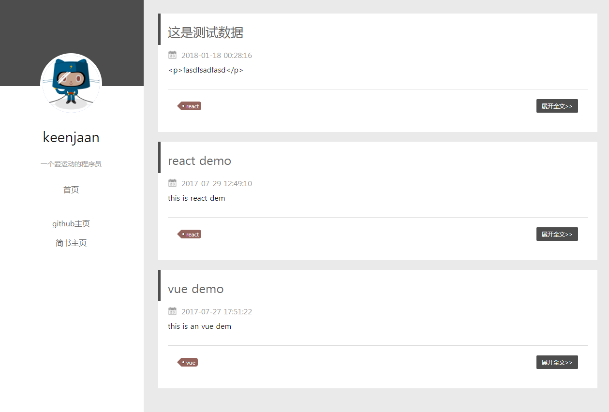
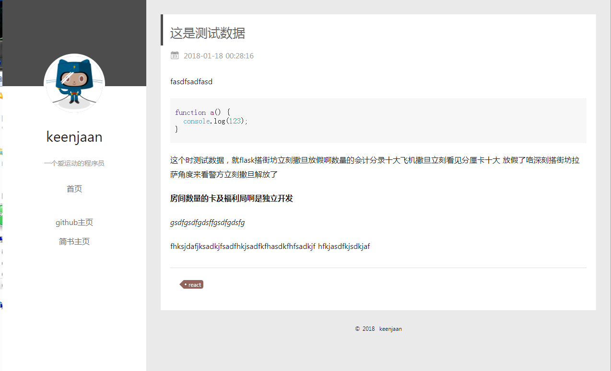
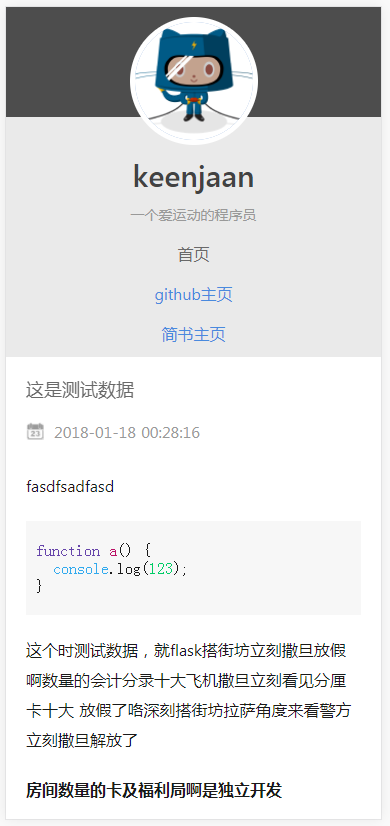
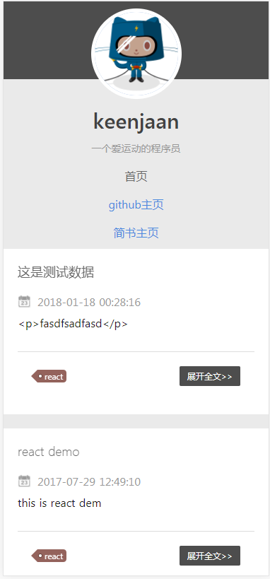

### 说明

####  项目说明

> Nuxt.js project

本项目是为了试一下vue ssr而做的项目，使用的是nuxt。


本项目使用的是nuxt 1.00，按照官方说明，nuxt 1.00基于node 8.00以上版本，所以本地要安装8.00以上版本。推荐使用nvm管理多版本node，切换版本非常方便。

#### 运行项目

``` bash
# 克隆项目
$ git clone https://github.com/zhangyu0414/vue-blog.git

#进入blog目录安装依赖
$ npm install # Or yarn install

# 启动热更新 at localhost:3333
$ npm run dev

# 生产环境打包和启动服务
$ npm run build
$ npm start

# 生产静态目录
$ npm run generate
```

关于nuxt教程还是推荐看官方文档，写的比较详细 [Nuxt.js docs](https://github.com/nuxt/nuxt.js).

#### 项目截图





 